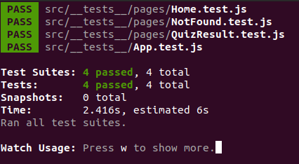
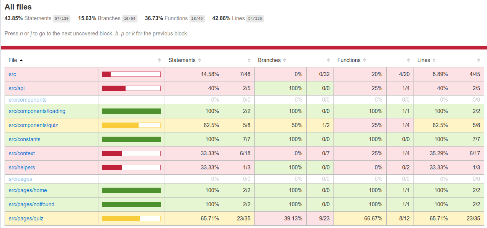
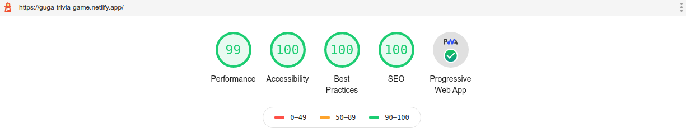

# Trivia Game PWA

# See Running

https://guga-trivia-game.netlify.app/

## Technology Used

React

## How To Install

* clone the project with 
```
git clone https://github.com/gugazimmermann/triviaGame.git
```
* go to the project folder 
```
cd triviaGame
```

## How To Run

#### First Time

```
npm install
```

#### After download all the modules

```
npm start
```
 
If not  open with the start command, go to http://localhost:3000/

## API Endpoint

API Endpoint: https://opentdb.com/api.php?amount=10&difficulty=hard&type=boolean

## How to Test

### Watch Mode

```
npm test
```


### Code Coverage

```
npm run test:coverage
```
* you can find the report inside `./coverage/lcov-report/index.html`



### Lighthouse

Open the PWA (https://guga-trivia-game.netlify.app/) in Chrome, open the Developer Tools (Ctrl + Shift + I / Option + Command + I), go to Lighthouse tab and click `Generate report`



### Icon and API from https://www.g2i.co/